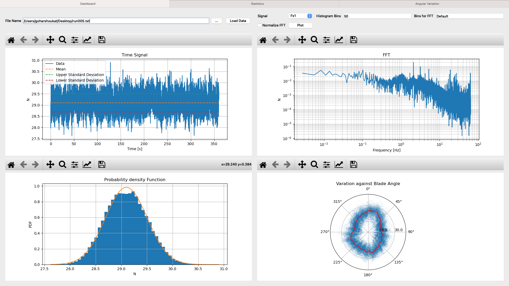

# Site-Surveying-Data-handling-Visualiation 

API for quick data processing and visualisation, particlarly for experimentation, offshore site surveying and resource assessments.
Instructions for use:
* Define the path to the data file. 
* Load the data file
* Select the signal you want to analyse
* The default bins for the histogram are 50 and the default length of the fft is the original length of the signal. By adjusting the bins for the FFT, you can reduce the length and make the FFT less noisy. 
* The file format can be changed, however slight adjustments will then need to be made in data_import_func file under fucntion access_file to accomodate for your file format. 
* The graphs to be displayed can be adjusted as well. The plot function in the Dashboard contains the information for plotting, by adjusting that, you will be able to display the graphs of your preference. 

External Libraries needed to run the dashboard:
* Pyqt5
* csaps

A snapshot of the dashboard:

A quick video demonstration:
https://user-images.githubusercontent.com/25367760/114305140-330bf580-9ad7-11eb-8a77-fa0f1f76cc80.mp4

For Citation:
@misc{Survey,
  author = {Shoukat, Gohar.},
  title = {Site-Surveying-Data-handling-Visualiation},
  year = {2021},
  publisher = {GitHub},
  journal = {GitHub repository},
  howpublished = {\url{https://zenodo.org/badge/latestdoi/356184371}},
  
}
